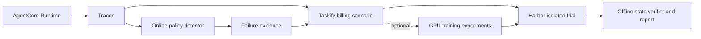

# AgentOps Simulation Loop

Passive agent traces can reveal failures, but cannot establish whether a proposed change fixes a regression. This reference implementation connects a synthetic billing agent, trace-based online detection, Taskify scenarios, and isolated Harbor trials that verify resulting world state.



| Track | What it demonstrates | Requirements |
| --- | --- | --- |
| Local example | Known bad and correct scripted billing behavior | Python and uv; no AWS |
| Harbor and Taskify | Isolated replay, state verification, integrity checks | Docker |
| Live AWS loop | AgentCore, DSQL, online detection, trace-backed taskification | Your AWS account; explicit opt-ins |
| RL research | Frozen Qwen baselines, SFT/GRPO experiments and negative results | Optional GPU environment |

## Start locally

Use Python 3.12, uv, Git, and Make. Docker is needed only for the final two commands; no AWS credentials, Bedrock access, or GPU are needed.

```bash
uv sync --locked --all-groups
make demo MODE=bad
make demo MODE=correct
make harbor-e2e
make taskify-fixture-harbor
```

The bad candidate refunds a disputed invoice. The correct candidate escalates it and leaves the invoice disputed. Harbor verifies Oracle and correct rewards of `1`, and bad reward of `0`. The Taskify fixture must produce a `VALIDATED` reproduction with the originating failure still failing. See [the walkthrough](docs/quickstart.md) for reports and troubleshooting.

For local browser chat, install Node 22 and pnpm 11.19.0:

```bash
make chat
make chat AGENTCORE_CANDIDATE=scripted-bad
make chat AGENTCORE_CANDIDATE=bedrock BEDROCK_MODEL_ID=YOUR_MODEL_ID
```

The default chat uses a scripted candidate without credentials. Bedrock is deliberate opt-in. The browser and API bind locally; this app has no public-hosting authentication.

## Read further

- [Architecture](docs/architecture.md), [contracts](docs/contracts.md), and [evaluation](docs/evaluation.md)
- [AWS deployment](docs/aws-deployment.md) and [operator safety](docs/aws-safety.md)
- [RL training](docs/rl-training.md) and [research results](docs/research-results.md)
- [Cost and security](docs/cost-and-security.md), [redistribution review](docs/third-party-notices.md), and [security policy](SECURITY.md)
- [Contributing](CONTRIBUTING.md) and [MIT license](LICENSE)

This is a demo/reference implementation using synthetic billing data. Scripted candidates demonstrate pipeline behavior, not model quality. Taskify supports the included billing trace contract, not arbitrary agents. There is no automatic candidate promotion. The registered Phase 11 and Phase 12 learning gates did not establish generalization or production readiness. AWS deployment is intentionally limited to `us-west-2`.
